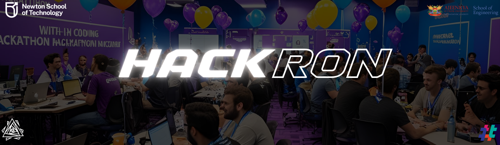

# HACKRON - 24-Hour Hackathon Platform

A cyberpunk-themed hackathon management platform for NST 24-hour coding competition, featuring a terminal-style interface and real-time dashboard.




## 🚀 Features

### For Teams
- **Team Registration & Login**
  - Secure authentication system
  - Cyberpunk-themed user interface
- **Interactive Team Dashboard**
  - Real-time status updates
  - **Live Broadcast System:** Receive urgent alerts and admin messages instantly via a modal overlay
  - **Project Submission Portal:** Detailed submission form with validation for GitHub repos, demo URLs, and tech stack
  - GitHub Repository tracking
  - Gamified stats display

### For Admins
- **Admin Control Panel**
  - Secure admin registration with special key
  - Team management & oversight
  - **Broadcast System:** Send real-time alerts to all connected teams
  - Submission tracking

### Event Details
- **Event:** 24-Hour Non-Stop Coding Hackathon
- **Date:** 31st Jan - 1st Feb 2026
- **Venue:** Lab 1 & 2, School of Management, ADYPU
- **Participants:** UG Students
- **Prize Pool:** ₹75,000

## 💻 Tech Stack
- **Framework:** Next.js (App Router)
- **Backend:** Firebase (Authentication & Realtime Database)
- **Styling:** Tailwind CSS
- **Animations:** Framer Motion
- **Language:** TypeScript

## 📅 Event Timeline

### Day 1: January 31st
- **09:00 AM - 10:00 AM:** Onboarding
- **10:00 AM - 12:00 PM:** Workshop + Briefing
- **12:00 PM:** Hackathon Starts & Problem Statement Release
- **04:00 PM - 06:00 PM:** Checkpoint 1
- **06:30 PM - 09:00 PM:** Break (Concert Optional)

### Day 2: February 1st
- **01:00 AM - 03:00 AM:** Checkpoint 2
- **09:00 AM - 10:00 AM:** Submission Window
- **10:00 AM - 12:30 PM:** Evaluation (Top 10)
- **01:00 PM - 03:00 PM:** Final Presentation & Prize Distribution

## 🛠️ Setup

1. **Clone & Install**
```bash
git clone [your-repo-url]
cd hackron
npm install
```

2. **Environment Setup**
Create `.env.local` with your Firebase config:
```env
NEXT_PUBLIC_FIREBASE_API_KEY=your_api_key
NEXT_PUBLIC_FIREBASE_AUTH_DOMAIN=your_auth_domain
NEXT_PUBLIC_FIREBASE_DATABASE_URL=your_database_url
NEXT_PUBLIC_FIREBASE_PROJECT_ID=your_project_id
NEXT_PUBLIC_FIREBASE_STORAGE_BUCKET=your_storage_bucket
NEXT_PUBLIC_FIREBASE_MESSAGING_SENDER_ID=your_sender_id
NEXT_PUBLIC_FIREBASE_APP_ID=your_app_id
```

3. **Run Development Server**
```bash
npm run dev
```

## 📱 Key Pages

- `/` - Landing page
- `/register` - Team registration
- `/team-dashboard` - Main hub for participants
- `/admin-dashboard` - Admin controls

## 🎨 UI Features

- **Pixelated Aesthetic:** Neon contrasts, pixel fonts, and glassmorphism.
- **Micro-interactions:** Hovers, glows, and smooth transitions.
- **Responsive Design:** Optimized for all devices.
- **Dynamic Animations:** Powered by Framer Motion for immersive experience.

## 📊 Judging Criteria

- Problem Statement Alignment
- Approach & Implementation
- Solution Analysis
- Presentation Quality
- Innovation Factor

## 📝 License

MIT License - Built with love for NST's Hackathon
